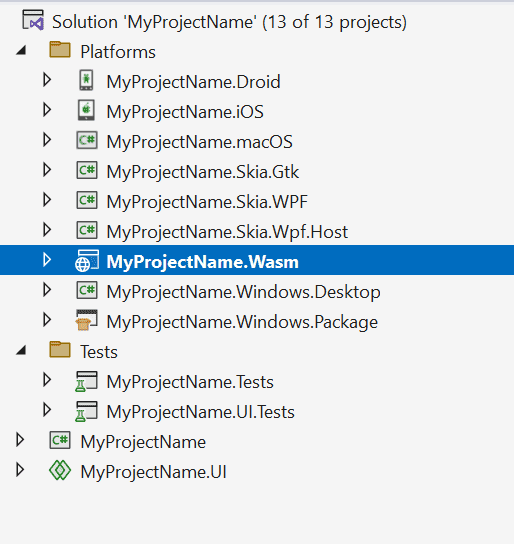

# How-To: Get Started with Uno.Extensions

Uno.Extensions is a series of NuGet packages designed to encapsulate common developer tasks associated with building multi-platform mobile, desktop and web applications using the Uno platform.

The Uno.Extensions follows the Microsoft.Extensions model that creates a host environment where you can register additional dependencies. The registered dependencies are then available throughout the application via Services (IServiceProvider) property on the IHost instance.

For a more specific description of the functionality included in each referenced package—such as
Configuration, Logging, Navigation, and
Reactive—refer to the relevant Uno.Extensions documentation. 

This tutorial will walk through how to create an Uno application with the `dotnet new` tool, that is already configured to use the Uno.Extensions. 

## Getting Started

`dotnet` project templates are used to easily create new projects. It simplifies the project renaming and supports conditional inclusions.

**Installing and generating a set of projects from the template**

1. Open a command prompt and run the following

    `dotnet new -i Uno.Extensions.Templates`

2. Navigate to the desired projects directory, and use the unoapp-extensions template to generate the starter solution discussed above

    `dotnet new unoapp-extensions -o MyProjectName` 

    The argument specified after the -o flag (i.e. MyProjectName) will act as the name for both a containing directory and the generated solution, so it is not required to create a new directory for the output.

3. Open the solution in Visual Studio

    `.\MyProjectName\MyProjectName.sln`

## Exploring the Solution

The generated solution will contain:

- *MyProjectName* - for application logic, and other constructs like view models and services that are independent of the UI of the application.
- *MyProjectName.UI* - for controls, pages, and views comprising the app’s UI layer.
- *Platforms/MyProjectName.** - platform-specific projects for each supported platform.
- *MyProjectName.Tests* and *MyProjectName.UI.Tests* - for writing unit and UI tests respectively.

    

# Running the Application 

1. Select a target from the drop-down as pictured below

    

2. Click the “play” button, or press F5 to start debugging. The necessary projects in the solution will be compiled and deployed based on the target platform.

# Running the Tests

The Uno.Extensions template includes projects for writing unit tests (MyProjectName.Tests) that are independent of the UI and writing tests that will validate the UI of the application (MyProjectName.UI.Tests).

## Running the Unit Tests

1. Right click the project inside Tests\\MyProjectName.Tests to open the context menu

2. Select *Run Tests*

The application will be compiled and the test cases will run.

Note: If the 'Run Tests' menu item doesn't exist, you need to Rebuild the solution to get Visual Studio to detect the available tests.

## Running the UI tests

1. Right click the MyProjectName.Wasm project to open the context menu

2. Select *Set as startup project*

3. Press Ctrl + F5 to start the WASM project without debugging.

4. Once the application is compiled, it will launch inside your default browser. Take note of the URL which should look something like this: https://localhost:11111/

5. Find the project *Tests\\MyProjectName.UI.Tests* and locate the *Constants.cs* file

6. Open *Constants.cs* and update the WebAssemblyDefaultUri constant

    It should appear similar to this: 

    `public readonly static string WebAssemblyDefaultUri = "https://localhost:11111/";`

7. Go back to the project *Tests\\MyProjectName.UI.Tests* and right click. Then, *Run Tests*

## Viewing test results

The results of both test types can now be inspected from the Test Explorer of Visual Studio (Ctrl + E, T). The *Tests* output in the Output window may also provide helpful information. When making changes to the application, remember to close the browser windows in order for a new version of the application to be properly loaded the next time UI tests are run.