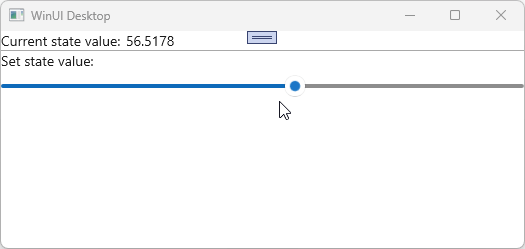

# What are States

## States are stateful Feeds

Like [Feeds](xref:Overview.Mvux.Feeds), States are used as a gateway that manage asynchronous data requests from services, and wrap them in metadata that provides information about the current request state or data state - whether the request is still in progress, when an error occurs, or if the data contains no records.

Contrary to Feeds, States are stateful (hence the name!), and do keep track of the state of the Model and its entities.  

MVUX utilizes its powerful code-generation engine to generate a Bindable Proxy Model for each Model, which holds the state information of the data, as well as Bindable Proxy Entities where needed, for instance if the entities are immutable (e.g. records - the recommended type).  
These are required so that the immutable entities are recreated anew in response to updates the user makes in the View.

> [!NOTE]
> States keep the state of the data, so every new subscription to them, (such as awaiting them or binding them to an additional control etc.), will use the data currently loaded in the State (if any).  
To reload the data, a refresh is required.

To summarize the differences from Feeds:

1. When subscribing to a state, the currently loaded value is going to be replayed.
2. State provides the `Update` method that allows changing its current value.
3. States are attached to an owner and share the same lifetime as that owner.
4. The main usage of state is for two-way bindings.

## States are attached to their owner

Besides holding the state information, a reference to the bindable proxy is shared with the States so that when the View is closed and disposed of, it tunnels down to the States and the Models and makes them available for Garbage-Collection. It shares the same lifetime as its owner.

## How to use States

### Creation of States

#### From Tasks

States are created slightly different, they require a reference to the Model for caching and GC as mentioned above.

```c#
public IState<Person> MainContact => State.Async(this, ContactsService.GetMainContact);
```

Where `GetMainContact` is a `ValueTask<Person>`, and takes a parameter of `CancellationToken`.

#### From Async-Enumerables

A State can also be created from an Async Enumerable as follows:

```c#
public IState<StockValue> MyStockCurrentValue => State.AsyncEnumerable(this, ContactsService.GetMyStockCurrentValue);
```

Make sure the Async Enumerable methods has a `CancellationToken` parameter, and is decorated with the `EnumerationCancellation` attribute.  
You can learn more about Async Enumerables in [this article](https://learn.microsoft.com/en-us/archive/msdn-magazine/2019/november/csharp-iterating-with-async-enumerables-in-csharp-8#a-tour-through-async-enumerables).

#### Other ways to create feeds

There are additional way to create States, so that you can update them at a later stage:

- With a synchronous initial value, and update it at a later stage:

    ```c#
    public IState<City> CurrentCity => State.Value(this, () => new City("Montréal"));
    ```

- Without any initial value:

    ```c#
    public IState<City> CurrentCity => State<City>.Empty(this);
    ```

- Construct your own custom State by directly creating its `Message`s.  
  This is intended for advanced users and is demonstrated [here](xref:Overview.Reactive.State#create).

### Usage of States

States are advanced Feeds. As such, they can also be awaited directly:

```c#
City currentCity = await this.CurrentCity;
```

#### How to bind the View to a State

1. In an MVUX app (read [How to set up an MVUX project](xref:Overview.Mvux.HowToMvuxProject)), add a Model class with a simple state as follows:

    ```c#
    public partial record SliderModel
    {
        // create a state with an initial random double value between 0 and 1, multiplied by 100.
        public IState<double> SliderValue => State.Value(this, () => Random.Shared.NextDouble() * 100);
    }
    ```

1. Replace all child elements in the _MainPage.xaml_ with the following:

    ```xaml
    <Page 
        x:Class="SliderApp.MainPage"
    	xmlns="http://schemas.microsoft.com/winfx/2006/xaml/presentation"
    	xmlns:x="http://schemas.microsoft.com/winfx/2006/xaml"
        xmlns:local="using:SliderApp">
        <Page.DataContext>
            <local:BindableSliderModel />
        </Page.DataContext>
    
        <StackPanel>
            <StackPanel Orientation="Horizontal" Spacing="5">
                <TextBlock Text="Current state value:"/>
                <TextBlock Text="{Binding SliderValue}"/>
            </StackPanel>
    
            <Border Height="1" Background="DarkGray" />
    
            <TextBlock Text="Set state value:"/>
            <Slider Value="{Binding SliderValue, Mode=TwoWay}" />
        </StackPanel>
    </Page>
    ```

    > [!NOTE]
    > `BindableSliderModel` refers to the generated Bindable Proxy Model.
    
    1. When you run the app, moving the `Slider` instantly affects the upper `TextBox`; the `Silder.Value` property has a two-way binding with the `SliderValue` State, so any change to the Slider immediately updates the State value, which in turn affects the data-bound `TextBlock` on top:

    


### Change data of a State

To update the current data in a State, use its `UpdateValue`.  
For example:

```c#
public async ValueTask SetFavoritePerson(CancellationToken ct)
{
    var newPerson = new Person("Terry Fox");
	await FavoritePerson.Update(updater: currentValue => newPerson, ct);
}
```

> [!NOTE]  
> There are additional methods to update the data of a State, explained [here](xref:Overview.Reactive.State#update-how-to-update-a-state).
