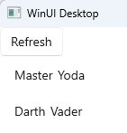

# How to create a list feed

In this tutorial you will learn how to create an MVUX project that asynchronously requests and displays a collection of items from a service,
and enables refreshing the data.

1. Create an MVUX project by following the steps in [this](xref:Overview.Reactive.HowTos.CreateMvuxProject) tutorial, and name your project `PeopleApp`.
1. Add a class named *PeopleService.cs*, and replace its content with the following:

    ```c#
    using System;
    using System.Collections.Immutable;
    using System.Threading;
    using System.Threading.Tasks;

    namespace PeopleApp;

    public class PeopleService
    {
        public async ValueTask<IImmutableList<Person>> GetPeopleAsync(CancellationToken ct)
        {
            await Task.Delay(TimeSpan.FromSeconds(2), ct);

            var people = new Person[]
            {
                new Person(FirstName: "Master", LastName: "Yoda"),
                new Person(FirstName: "Darth", LastName: "Vader")
            };

            return people.ToImmutableList();
        }
    }

    public partial record Person(string FirstName, string LastName);  
    ```

  We're using [records](https://learn.microsoft.com/en-us/dotnet/csharp/language-reference/builtin-types/record) in purpose,
  as records are immutable and ensure purity of objects. Records also implements easy equality comparison and hashing.

  The `IListFeed` is a feed tailored for dealing with collections.

1. Create a file named *PeopleModel.cs* replacing its content with the following:

```c#
public partial record PeopleModel
{       
    private readonly PeopleService _peopleService = new();
    
    public IListFeed<Person> People => ListFeed.Async(_peopleService.GetPeopleAsync);
}
```

MVUX's analyzers will read the `PeopleModel` and will generate a special mirrored `BindablePeopleModel`,
which provides binding capabilities for the View, so that we can stick to sending update message in an MVU fashion.

The `People` property value also gets cached, so no need to worry about its being created upon each `get`.

<!-- TODO the generated code can be inspected via project->analyzers etc. -->

1. Open the file `MainView.xaml` and add the following namespace to the XAML:

`xmlns:mvux="using:Uno.Extensions.Reactive.UI"`

1. Replace anything inside the `Page` element with the following code:

```xaml
<mvux:FeedView Source="{Binding People}">
    <DataTemplate>
        <ListView ItemsSource="{Binding Data}">
            <ListView.Header>
                <Button Content="Refresh" Command="{Binding Refresh}" />
            </ListView.Header>
            <ListView.ItemTemplate>
                <DataTemplate>
                    <StackPanel Orientation="Horizontal" Spacing="5">
                        <TextBlock Text="{Binding FirstName}"/>
                        <TextBlock Text="{Binding LastName}"/>
                    </StackPanel>
                </DataTemplate>
            </ListView.ItemTemplate>
        </ListView>
    </DataTemplate>

    <!-- Optional: this will show up when loading, or when we click refresh and data is still loading -->    
    <mvux:FeedView.ProgressTemplate>
        <DataTemplate>            
            <TextBlock Text="Loading people..."/>
        </DataTemplate>
    </mvux:FeedView.ProgressTemplate>
</mvux:FeedView>
```

The `FeedView` wraps its source (in this case our `People` feed) in a `FeedViewState` object
that provides the `Data` property to access the entities currently available in the `People` feed,
the `Refresh` command that explicitly triggers reloading the trip.

1. Press <kbd>F7</kbd> to navigate to open code-view, and in the constructor, after the line that calls `InitializeComponent()`, add the following line:

```c#
this.DataContext = new BindablePeopleModel();
```

The `BindablePeopleModel` is a special MVUX-generated mirror object that represents a mirror of the `PeopleModel` adding binding capabilities,
for MVUX to be able to recreate and renew the model when an update message is sent by the view.  
MVUX also generates a bindable version of `Person`, named `BindablePerson`,
which can be used by the binding engine to send update message to the model. <!--TODO link to relevant docs-->

1. Click F5 to run the project

1. When the app loads you'll notice how the `ProgressTemplate` shows (if you've included one), till the data is received from the service (2 seconds).



1. Once the data is the available, the `FeedView` switches to its `ValueTemplate` (the first default `DataTemplate` in our example),
and displays the people list.


